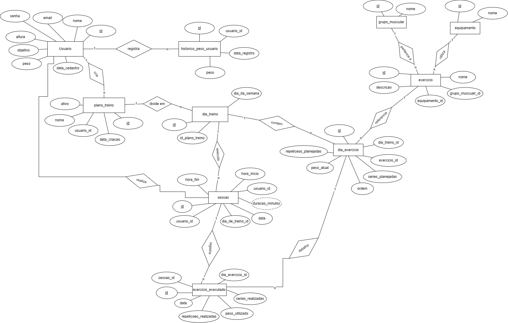

# GymTracker - Ambiente de Dados

Projeto de banco de dados relacional para uma aplicação de acompanhamento de treinos de academia. O GymTracker permite organizar usuários, objetivos, planos de treino, exercícios, sessões realizadas e a evolução de peso corporal e de cargas.

## Funcionalidades

- Cadastro de usuários e seus objetivos de treino.
- Registro do histórico de peso corporal.
- Catálogo de exercícios por grupo muscular e equipamento.
- Criação de planos organizados por dia da semana.
- Planejamento de séries, repetições, carga e ordem dos exercícios.
- Registro de sessões e exercícios executados.
- Consultas com `INNER JOIN`, `LEFT JOIN`, `RIGHT JOIN`, `UNION`, `EXISTS` e `IN`.
- Views para exposição segura de usuários e consolidação de indicadores.
- Triggers para validação, auditoria e atualização automática de dados.

## Tecnologias

- MySQL 8.0 ou superior
- MySQL Workbench, terminal MySQL ou outro cliente compatível
- Draw.io e MySQL Workbench para os modelos do banco

## Modelo de dados

O banco é composto pelas seguintes entidades principais:

| Entidade | Responsabilidade |
| --- | --- |
| `usuario` | Armazena dados pessoais, objetivo e peso atual |
| `historico_peso_usuario` | Mantém a evolução do peso corporal |
| `grupo_muscular` | Cataloga os grupos musculares |
| `equipamento` | Cataloga os equipamentos utilizados |
| `exercicio` | Descreve os exercícios disponíveis |
| `plano_treino` | Representa os planos criados para cada usuário |
| `dia_treino` | Organiza um plano por dia da semana |
| `dia_exercicio` | Define exercícios, séries, repetições e cargas planejadas |
| `sessao` | Registra a realização de um treino |
| `exercicio_executado` | Armazena o desempenho obtido em cada exercício |
| `log_peso_usuario` | Audita alterações feitas no peso do usuário |

### Diagrama Entidade-Relacionamento



Os arquivos editáveis dos modelos estão disponíveis no diretório [`docs`](docs):

- [`DER_GYMTRACKER.DRAWIO`](docs/DER_GYMTRACKER.DRAWIO)
- [`MER-GYMTRACKER.mwb`](docs/MER-GYMTRACKER.mwb)

## Estrutura do projeto

```text
gymtracker-ambiente-dados/
|-- docs/
|   |-- DER_GYMTRACKER.DRAWIO
|   |-- DER_GYMTRACKER.drawio.png
|   |-- MER-GYMTRACKER.mwb
|   `-- MER_GYMTRACKER.png
|-- sql/
|   |-- 01_ddl.sql
|   |-- 02_inserts.sql
|   |-- 03_consultas.sql
|   `-- 04_views_triggers.sql
`-- README.md
```

## Como executar

### Opção 1: MySQL Workbench

1. Conecte-se a uma instância do MySQL 8 ou superior.
2. Abra os arquivos da pasta `sql`.
3. Execute os scripts, obrigatoriamente, nesta ordem:

```text
01_ddl.sql
02_inserts.sql
03_consultas.sql
04_views_triggers.sql
```

O primeiro script cria e seleciona automaticamente o banco `gymtracker`.

### Opção 2: terminal MySQL

Abra o cliente a partir da raiz do projeto:

```bash
mysql -u root -p
```

No console do MySQL, execute:

```sql
SOURCE sql/01_ddl.sql;
SOURCE sql/02_inserts.sql;
SOURCE sql/03_consultas.sql;
SOURCE sql/04_views_triggers.sql;
```

> Caso o cliente não encontre os arquivos, utilize o caminho absoluto com barras `/`.

## Conteúdo dos scripts

| Script | Descrição |
| --- | --- |
| `01_ddl.sql` | Cria o banco, as tabelas, chaves, relacionamentos e restrições |
| `02_inserts.sql` | Povoa o banco com usuários, exercícios, planos e sessões de exemplo |
| `03_consultas.sql` | Apresenta consultas para análise e geração de relatórios |
| `04_views_triggers.sql` | Cria views, tabela de auditoria e triggers de automação |

## Views

### `vw_usuario_publico`

Disponibiliza os dados dos usuários sem expor o campo de senha.

```sql
SELECT * FROM vw_usuario_publico;
```

### `vw_painel_usuario`

Consolida objetivo, peso atual, total de sessões e total de exercícios executados por usuário.

```sql
SELECT * FROM vw_painel_usuario;
```

## Triggers

| Trigger | Evento | Comportamento |
| --- | --- | --- |
| `trg_validar_sessao_aberta` | Antes de inserir um exercício executado | Impede registros em sessões já finalizadas |
| `trg_historico_peso` | Depois de atualizar um usuário | Registra mudanças de peso no histórico e no log de auditoria |
| `trg_duracao_sessao` | Depois de atualizar uma sessão | Calcula a duração ao informar o horário de término |
| `trg_peso_atual_exercicio` | Depois de inserir um exercício executado | Atualiza a carga atual do exercício planejado |

## Exemplos de uso

Consultar o painel consolidado:

```sql
USE gymtracker;

SELECT *
FROM vw_painel_usuario
ORDER BY total_sessoes DESC;
```

Atualizar o peso de um usuário e acionar o histórico automático:

```sql
UPDATE usuario
SET peso = 81.50
WHERE id_usuario = 1;

SELECT * FROM historico_peso_usuario WHERE usuario_id_usuario = 1;
SELECT * FROM log_peso_usuario WHERE usuario_id = 1;
```

Finalizar uma sessão para calcular sua duração:

```sql
UPDATE sessao
SET hora_fim = '09:10:00'
WHERE idsessao = 13;

SELECT idsessao, hora_inicio, hora_fim, duracao_minutos
FROM sessao
WHERE idsessao = 13;
```

## Observações

- Os dados presentes em `02_inserts.sql` são fictícios e destinados a testes.
- As senhas inseridas são valores demonstrativos, não credenciais reais.
- A ordem de execução deve ser respeitada por causa das dependências entre tabelas, dados, views e triggers.
- Para recriar o ambiente do zero, remova previamente o banco `gymtracker` ou utilize uma instância limpa.
